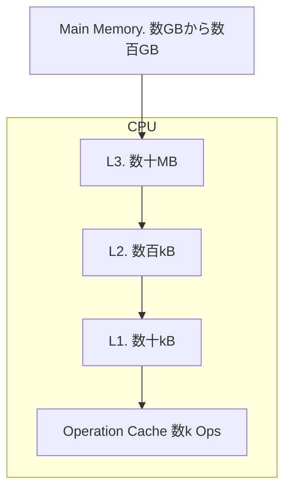

# 基礎知識&小話

## CPU アーキテクチャ

CPUには大きくx86/64とaarch64(arm64)アーキテクチャがある。x64向けにビルドしたものをarmでは使用できず逆もできないので注意が必要である。

主なCPU
- x86-64
    - Intel Core
    - Intel Xeon
    - AMD Ryzen
    - AMD EPYC
- Arm64
    - Apple Ax, Mx
    - NVIDIA Grace
    - Ampere Altra

## メモリ階層
プログラム中で宣言した変数や関数はメモリ常に展開され、計算を行う際に適宜CPUに送られる。その流れを確認する。
キャッシュフレンドリーなプログラムとは下記のようなキャッシュにデータが効率的に乗ることをいう。



## コンパイラ
C++コンパイラは複数種類あり環境や目的によって適切に選択する必要がある。


| Feature/Aspect       | gcc                          | clang                        | msvc                          | icc                           | nvcc                          |
|----------------------|------------------------------|------------------------------|------------------------------|------------------------------|------------------------------|
| **Full Name**        | GNU Compiler Collection      | Clang                        | Microsoft Visual C++         | Intel C++ Compiler           | NVIDIA CUDA Compiler         |
| **Platform Support** | Linux, Windows, MacOS, etc. | Linux, Windows, MacOS, etc. | Windows | Linux | Linux, Windows |
| **Open Source**      | Yes                          | Yes                          | No                           | No                           | No                           |
| **Primary Use Case** | 汎用 | 汎用 | Windows向け開発 | HPC | GPGPU |

このほかにも様々なコンパイラがある。

`Apple Clang`,
`EDG eccp`,
`IBM XL C++`,
`IBM Open XL C++ for AIX`,
`IBM Open XL C++ for z/OS`,
`Sun/Oracle C++`,
`Embarcadero C++ Builder`,
`Cray`,
`Nvidia HPC C++ (ex PGI)`


## SIMD
SIMD(Single Instruction Multiple Data)とは書いてある通り一命令で複数のデータを操作することができる技術である。
例えば以下のプログラムを考えるとする。見ると掛け算の命令が4回発生していることがわかる。
```cpp
auto proc(double a, double b, double c, double d, double scale) -> double
{
    a *= scale;
    b *= scale;
    c *= scale;
    d *= scale;
    return a + b + c + d;
}
```

これらでSIMDを使うと下記のように書き換えられる。
このように掛け算命令が1回に減っていることがわかる。
```cpp
auto proc(double a, double b, double c, double d, double scale) -> double
{
    __m256d scale_vec = _mm256_set1_pd(scale);
    __m256d vec = _mm256_set_pd(d, c, b, a);
    
    __m256d result_vec = _mm256_mul_pd(vec, scale_vec);
    
    double result[4];
    _mm256_storeu_pd(result, result_vec);
    return result[0] + result[1] + result[2] + result[3];
}
```