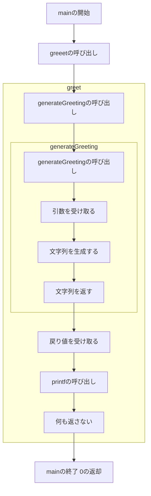

# 関数

プログラミングでは、同じ処理を何度も書くのは面倒です。そこで、同じ処理をまとめて名前をつけておくことができます。これを関数と呼びます。

## 関数の定義

C++では、関数を定義するには`関数の戻り値の型 関数名(引数)`という形式で書きます。

```cpp
戻り値の型 関数名(引数)
{
    // 関数の処理
}
```

```cpp
auto 関数名(引数) -> 戻り値の型
{
    // 関数の処理
}
```

実際に、挨拶を行うプログラムを書いてみましょう。

```cpp
#include <iostream>

void greet()
{
    std::cout << "Hello" << std::endl;
}

auto greet2() -> void
{
    std::cout << "Hello" << std::endl;
}

int main()
{
    greet();
    greet2();
}
```

最初のmain関数の中で、greet関数を呼び出しています。

<br>

## 関数の戻り値

関数は、戻り値を返すことができます。戻り値を返すには、関数の戻り値の型を指定します。

```cpp
戻り値の型 関数名(引数)
{
    // 関数の処理
    return 戻り値;
}
```

```cpp
auto 関数名(引数) -> 戻り値の型
{
    // 関数の処理
    return 戻り値;
}
```

実際に、挨拶を行うプログラムを書いてみましょう。

```cpp
#include <iostream>
#include <string>

auto generateGreeting(const int& age, const std::string name) -> std::string
{
    auto age_str = std::to_string(age);
    return age_str + "," + name;
}

void greet()
{
    std::cout << generateGreeting(20, "Taro") << std::endl;
}

int main()
{
    greet();
}

```

新しく、`generateGreeting`関数を定義しました。この関数は、`age`と`name`を受け取り、`Hello, Taro. You are 20 years old.`という文字列を返します。

<br>



<br>
