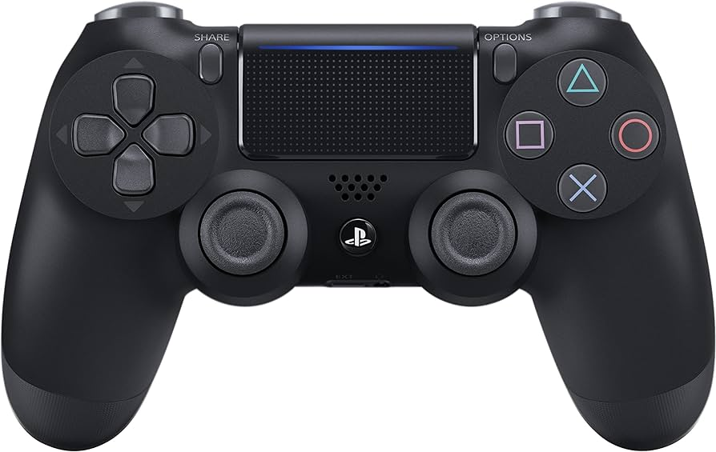

# DualShock4を扱う by Rust

## はじめに
ここではRustでDualshock4を扱うことができるようになります。



## プログラムは楽してなんぼ
ソフトウェアを始めたてのころはもちろんわからないことのほうが多いです。これを書いてる僕も自分一人でパッケージの中身を実装できるようになったのはつい最近で、それまでは他人のコードをコピーしたり先輩に聞いたりしてました笑。

今回は僕が用意したDualshock4を扱うコードを引用してコントローラー部分を実装していきましょう。

## Cargo.tomlの設定
ここでCargoというパッケージ管理システムを使ってきた良さが出てきます。これから**Rustで**他人の作ったライブラリなどを扱うときにはCargo.tomlに**依存関係**（使ってるライブラリとの関係みたいなこと）を記述します。
まずパッケージを作成しましょう。

```bash
cargo new ds_test
```
次にcdコマンドで作ったファイル内に移動してください
```bash
cd ds_test
```

そしてCargo.tomlに手を加えます。以下は初期状態です。
```toml
[package]
name = "ds_test"
version = "0.1.0"
edition = "2021"

# See more keys and their definitions at https://doc.rust-lang.org/cargo/reference/manifest.html

[dependencies]

```
今回手をつけるのは下の**dependencies**の部分です。ここに以下のような形式で使うライブラリを指定します。また、ここでの依存関係の書き方はライブラリが**Github**にあるものを前提としているので注意してください。
以下は**dualshock-driver**のGithubのリポジトリです。

[dualshock-driver](https://github.com/motii8128/dualshock-driver)

また、こちらのドライバーはasync（非同期的に）使われることが前提なのでメイン関数を非同期関数にするための**async-std**も用意します。こちらは**Github**から持ってくるわけではないので書き方が違います。
変更後はこちらです。
```toml
[package]
name = "ds_test"
version = "0.1.0"
edition = "2021"

# See more keys and their definitions at https://doc.rust-lang.org/cargo/reference/manifest.html

[dependencies]
dualshock-driver = {git = "https://github.com/motii8128/dualshock-driver"}
# リポジトリの名前 = {git = "リポジトリのリンク"}

async-std = "1.12.0"
# 名前 = バージョン
```

これでメインコード内で私の作戦した**dualshock-driver**が使えるようになりました。

## 実装
ここからはメインコードの記述です。
### useで使いますよ宣言
```rs
use dualshock_driver::{DualShock4Driver, BLE};
use async_std;
```
今回はドライバー本体の**Dualshock4Driver**とそのモードを指定する定数である**BLE**（ブルートゥース）を持ってきました。

### ドライバーの初期化
```rs
use dualshock_driver::{DualShock4Driver, BLE};

#[async_std::main]
async fn main() {
    let driver = DualShock4Driver::new(BLE).unwrap();
}
```
**async_std**の使い方についてはあまり触れませんが上記の書き方で非同期関数を呼び出せるようになります。(いくつかのタスクを並行かつ同タイミングではないように扱いたいときに使うことが多い)

**Dualshock4Driver**にインプリメントされた**new**という初期化関数を呼び出します。これは有線モードか、ブルートゥースモードかの値を引数にとり、ドライバー本体を返り値としています。
これでドライバーを使う準備が整いました。

### データの読み取り
ループ文を用意し、その中でコントローラーのデータを読み取りましょう。実装されたドライバーにインプリメントされた**read**関数を使います。
```rs
use dualshock_driver::{DualShock4Driver, BLE};
use async_std;

#[async_std::main]
async fn main() {
    let mut driver = DualShock4Driver::new(BLE).unwrap();

    loop {
        let read_data = driver.read().await.unwrap();

        let left_x_stick_data = read_data.sticks.left_x;

        println!("data:{}", left_x_stick_data);
    }
}

```

文章が複雑になってきました。read関数は非同期関数であるため、返り値に**Future**というものを持ちます（おそらく関数の結果をさすようなものでしょう）。しかし、それを使うことはないので**.await**とつけてあげることでResult型を取り出すことができます。最後に**unwrap**をしてあげることで関数にエラーがなかった想定で今後のコードをかくことができます。
上記の例文ではデータのうち左スティックの横方向の情報を変数に入れてますね。**read**関数は結果として**Dualshock4**という型を返します。そしてこれは構造体であるためドットを使うことでそれに含まれる変数にアクセスすることができます。

## おわりに
これでおそらくコントローラーを扱うことができたかと思います。次の章でミニロボへ向けた資料は終わるのでもう少し頑張りましょう。

[６．文字列送るのめんどくせーよの会](./serde.md)