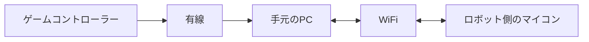

# ミニロボ向け

ロボットを動かすことのできる最低限のソフトウェアを学ぶことができます。（という執筆者もプログラムはロボット研究会に来てから始めた初心者なんですけどね笑）

# どのようなプログラムをするのか
ミニロボでは人とロボットが無線でつながる必要があるので以下のような形でプログラムする。

しかし、ロボットにPCを乗せるのはよっぽどの計算量がない限りはデメリットのほうが多いので避けたい。

なので今回はロボット側のマイコンと手元のPCとを同じWiFiにつなぐことで通信する。
そしてマイコンから電圧を出力するなどしてモータードライバを使っていきます。

## マイコンについて
[１．マイコンにふれる](./start_esp32.md)

[２．マイコンでUDP通信を始める](./udp_esp32.md)

## PCからの通信
[手元のPC側](./rust_udp.md)

## ゲームコントローラーを扱う
ゲームコントローラーを扱うプログラムについて

[ゲームコントローラーを扱う](./game_con.md)