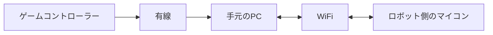

# ミニロボ向け

ロボットを動かすことのできる最低限のソフトウェアを学ぶことができます。

## どのようなプログラムをするのか
ミニロボでは人とロボットが無線でつながる必要があるので以下のような形でプログラムする。

しかし、ロボットにPCを乗せるのはよっぽどの計算量がない限りはデメリットのほうが多いので避けたい。

なので今回はロボット側のマイコンと手元のPCとを同じWiFiにつなぐことで通信する。

## 通信
通信についてはこちらをご覧ください

[ロボットに乗せるマイコン側](./esp32_udp.md)

[手元のPC側](./rust_udp.md)