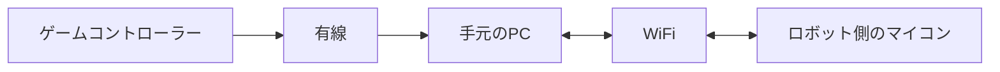

# ミニロボ向け

ロボットを動かすことのできる最低限のソフトウェアを学ぶことができます。

## どのような通信をするのか
ミニロボでは人とロボットが無線でつながる必要があるので以下のような形でプログラムする。

```mermaid
flowchart LR
    ゲームコントローラー --> 有線
    有線 --> 手元のPC
    手元のPC <--> WiFi
    WiFi <--> ロボット側のマイコン
```