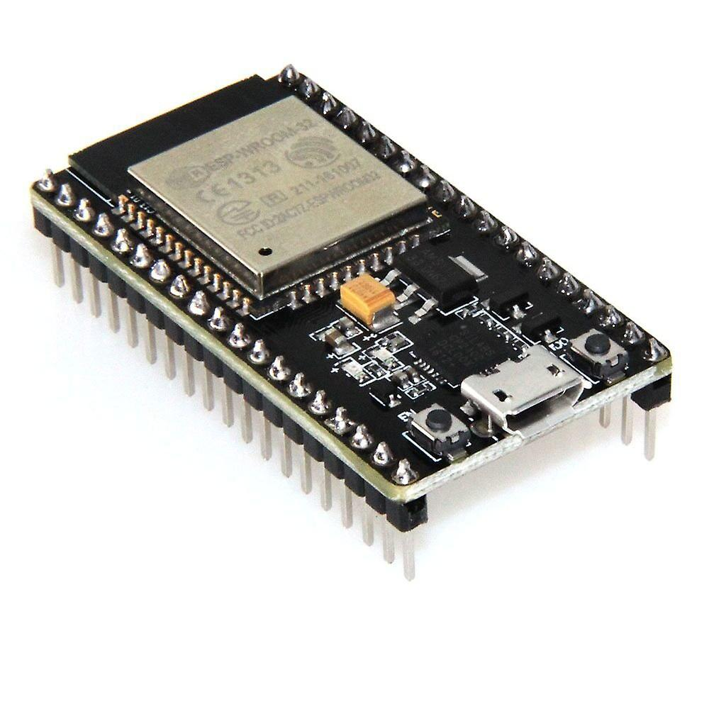
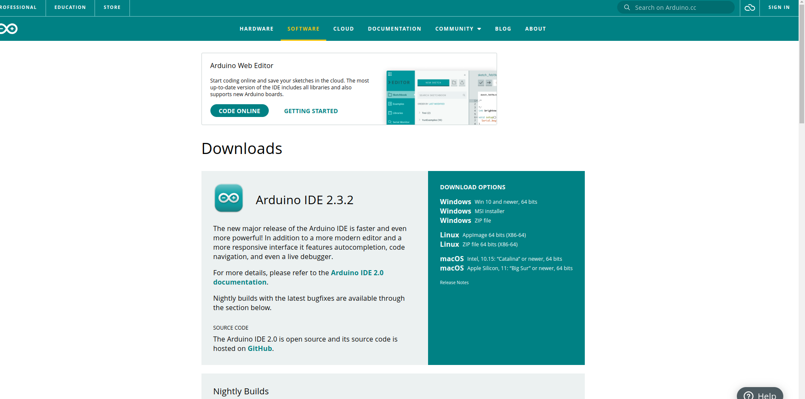
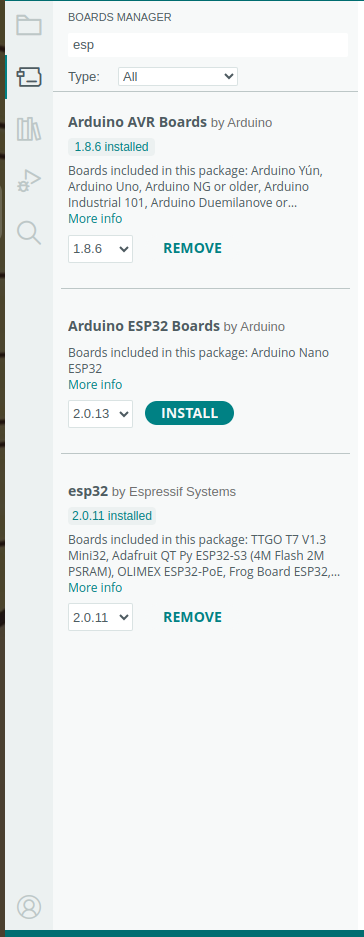

# マイコンにふれる



## マイコンって？
先程から登場していましたが***マイコン***とは通称マイクロコンピュータで電気機器を制御するための小さなコンピュータです。
例えばボタンを押した回数によって吹く風の強さを変えれる扇風機があるなら「ボタンを押すという入力を受けて、モーターを回す回転数を変える」という操作をしているのが***マイコン***にあたると思います。

そして今回使う***マイコン***が上に写真がある**esp-wroom-32**です。僕はesp32って呼んでます。
この***マイコン***にプログラムを書き込むことで色々なことができます。

## 環境構築
開発を始めるための環境構築の手引きです。

### ソフトのダウンロード
[こちらのリンク](https://www.arduino.cc/en/software)から「Arduino（アルディーノ）IDE」ダウンロードしてください。

Windowsの場合は下の写真の「Windows win10 and newer 64bits」クリックします。



### ESP32を開発するために...
先程ダウンロードしたソフトは通常は名前の通りArduinoと呼ばれるマイコンにしかプログラムの書き込みをすることができません。
今回はダウンロードに加え***ESP32に書き込むため***のことをしなければなりません。
ArduinoIDEを起動（他のソフトと同じようにダブルクリックで開くはず）してください。
そして画面左上にある**File**をクリックしてください。


すると上の写真のようなツールバーが出るはずなので下から３つ目のプリファレンスを選択してください。

そして下のリンクを「Additional boards manager URLs」にコピーしてください。

```
https://github.com/earlephilhower/arduino-pico/releases/download/global/package_rp2040_index.json
```


### ボードライブラリのダウンロード
最後にボードライブラリをダウンロードします。画面左側のバーのうち、上から２番目を選択するとボードマネージャーが出るはずです。
検索欄に「esp」といれると、**esp32 by Espressif Systems**があるはずなのでインストールしてください。写真だと１番下ですね。



## マイコンのGPIO
***マイコン***にはたくさんの足が生えており、そのうちの大体を占めるのがGPIO（General Purpose Input/Output（ジェネラル・パーパス・インプット/アウトプット））です。これらは汎用I/Oとも呼ばれ、そこにかかる電圧を読み取ったり、電圧を出力したりできるわけです。まずは簡単にLEDを点灯するコードを見ていきましょう。

