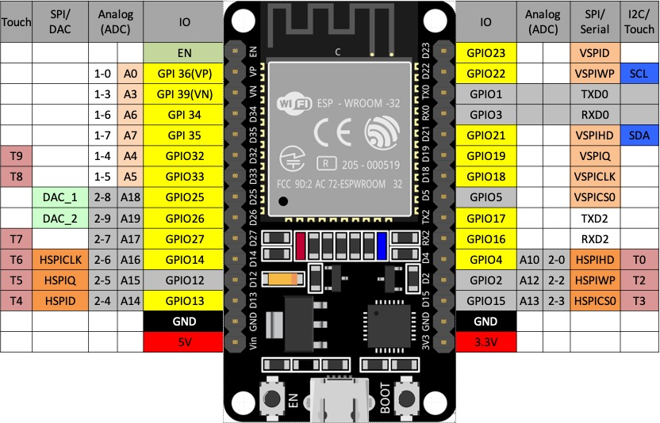
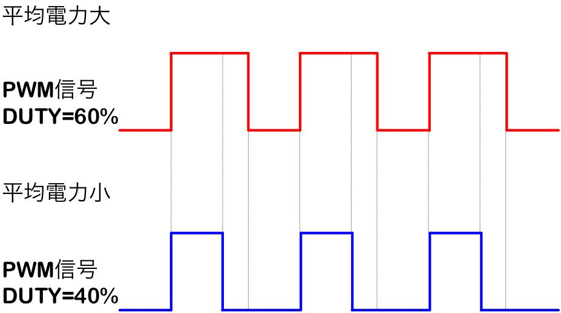

# マイコンにふれる


## マイコンって？
先程から登場していましたが***マイコン***とは通称マイクロコンピュータで電気機器を制御するための小さなコンピュータです。
例えばボタンを押した回数によって吹く風の強さを変えれる扇風機があるなら「ボタンを押すという入力を受けて、モーターを回す回転数を変える」という操作をしているのが***マイコン***にあたると思います。

そして今回使う***マイコン***が上に写真がある**esp-wroom-32**です。僕はesp32って呼んでます。
この***マイコン***にプログラムを書き込むことで色々なことができます。

## 環境構築
開発を始めるための環境構築の手引きです。

### ソフトのダウンロード
[こちらのリンク](https://www.arduino.cc/en/software)から「Arduino（アルディーノ）IDE」ダウンロードしてください。

Windowsの場合は下の写真の「Windows win10 and newer 64bits」クリックします。


### ESP32を開発するために...
先程ダウンロードしたソフトは通常は名前の通りArduinoと呼ばれるマイコンにしかプログラムの書き込みをすることができません。
今回はダウンロードに加え***ESP32に書き込むため***のことをしなければなりません。
ArduinoIDEを起動（他のソフトと同じようにダブルクリックで開くはず）してください。
そして画面左上にある**File**をクリックしてください。


すると上の写真のようなツールバーが出るはずなので下から３つ目のプリファレンスを選択してください。

そして下のリンクを「Additional boards manager URLs」にコピーしてください。

```
https://github.com/earlephilhower/arduino-pico/releases/download/global/package_rp2040_index.json
```


### ボードマネージャーのダウンロード
最後にボードマネージャーをダウンロードします。画面左側のバーのうち、上から２番目を選択するとボードマネージャーが出るはずです。
検索欄に「esp」といれると、**esp32 by Espressif Systems**があるはずなのでインストールしてください。写真だと１番下ですね。


## プログラムを始める
### 関数
詳しくは調べてほしいのですが、これからでる「関数」とはある数字を引数として、なにかをするまたはなにかを結果として返すものです。
たとえば数学でいう関数は下のような式が合った時に、xという引数に数字を入れるとそれを２倍にした数がy、つまり関数の結果としてでます。

$$ y = 2x $$

上の式をC言語にして使用するなら以下のような感じです。
```cpp
int nibai(int x)
{
    return 2 * x
}

// メインコード内で
int a = 4;
int b = nibai(a); // b = 8
```

C言語における関数とは

関数の型：今回だと整数型int、他にも実数型のdouble、floatなどがあります

関数名：今回だとnibai

引数：nibaiのあとのカッコ内に書きます。２つ以上あっても大丈夫です。今回だとint xにあたります。

まとめると、整数型が関数の結果なので関数の前にint、そして関数に使う引数も整数型なのでintとついてるのですね。

このような関数は自分たちで作ることもできますが、用意されているのもあるのでどんどん活用していきましょう。

### Hello ESP32
よく使う画面表示するプログラムです。Arduinoでは大きく２つの関数があり、まず**setup関数**、これは起動時の最初の一回だけ動く関数です。
ここでは関数名の前にvoidと書いてますね。voidとは空を意味していてこの関数は何も結果を返さないよということです。
```cpp
void setup()
{
    Serial.begin(115200);
}
```
Arduinoではシリアルというのを用いてマイコン側からつながっているPCに画面表示します。上記のように通信速度を指定して初期化します。

そしてもう一つの関数が**loop関数**です。名前の通り、setupのあとに何回も繰り返し動く部分ですね。
```cpp
void loop()
{
    Serial.println("Hello ESP32");
    delay(500);
}
```
２つの関数がでてきました。println関数はシリアルに含まれている文字列を表示する関数です。「"」で囲まれた部分が文字列となるのですね。
そしてその後のdelayとはプログラムを停止して待つような関数で、ここでは0.5秒待つようになってます。

それではプログラムを実行してみてください。


### マイコンのGPIO



***マイコン***にはたくさんの足（ピン）が生えており、そのうちの大体を占めるのがGPIO（General Purpose Input/Output（ジェネラル・パーパス・インプット/アウトプット））です。これらは汎用I/Oとも呼ばれ、そこにかかる電圧を読み取ったり、電圧を出力したりできるわけです。まずは簡単にLEDを点灯するコードを見ていきましょう。

```cpp
void setup()
{
    pinMode(T2, OUTPUT);
}

void loop()
{
    digitalWrite(T2, HIGH);
    delay(500);
    digitalWrite(T2, LOW);
    delay(500);
}
```

setup関数では使うピンの設定を行っています。
pinModeという関数では１つ目の引数でどのピンを、２つ目の引数でどうしたいかを記述しています。ここではT2というピン（上の対応表を見ればわかるのですが、実際にはD2のことですね）を出力用のピンとして設定しています。

loop関数内ではdigitalWriteという関数が使われていますね。これは指定したピンにHIGHの場合は5V、LOWのときには0Vになるように出力します。
これでD2のピンから5Vが出たり出なかったりするためLEDをチカチカできるというわけです。

### LEDを調光する
先程はLEDを光らすことができました。ですが実際にモーターを回す際には0 or 100というよりはその間の力も出せたほうがなめらかに走れそうですよね。
そこで使うのがアナログ出力です。
論よりコードってやつです。

```cpp
void setup()
{
    ledcSetup(0, 12800, 8);

    ledcAttachPin(A12, 0);
}

void loop()
{
    // 0 ~ 256
    int power = 128;

    ledcWrite(0, power);
    delay(500);
    ledcWrite(0, 0);
    delay(500);
}
```
setup関数の操作が少し違いますね。ESP32でアナログ出力を扱う際には、チャンネルというのを作成します。
そこでsetup関数内のはじめで、ledcSetupという関数により0番というチャンネルをPWM周波数12800,8ビットで作成しています。 
8ビットなので256段階で強さを調整することができます。


ここでPWMについて軽く説明をいれておきます。Pulse Width Modulationというもので一定の周期のもとでスイッチのオンとオフを繰り返し出力を調整します。上の図の赤い線ではオンが6割オフが4割になるようにすることで出力は5Vの60パーになります。

話をもどして、ledcAttachPinでは作成したチャンネルをピンに割り当てます。先ほどと同じD2です。
loop関数内ではチカチカしたときと近い雰囲気ですね。256段階あるうちの128、つまり50パーという出力を変数で用意しておきました。
その次にledcWriteにより指定のチャンネルに指定のパワーを出力しました。その後、同じチャンネルを出力０にしてさっきとは強さの違うチカチカを実装することができました。

## おわりに
次は無線通信について学んでいきましょう

[２．マイコンでUDP通信を始める](./udp_esp32.md)