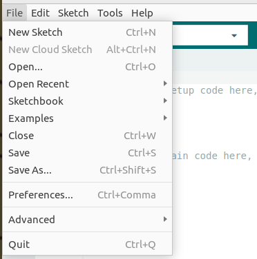
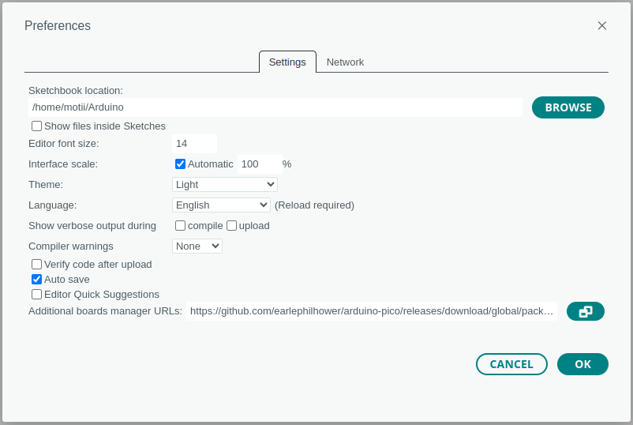
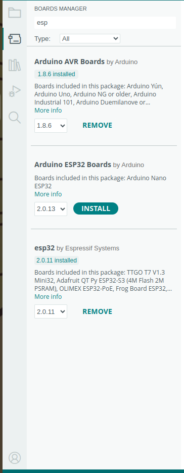

# ArduinoIDEでESP32を開発するための環境構築

## ソフトのダウンロード
[こちらのリンク](https://www.arduino.cc/en/software)から「Arduino（アルディーノ）IDE」ダウンロードしてください。

Windowsの場合は下の写真の「Windows win10 and newer 64bits」クリックします。


## ESP32を開発するために...
先程ダウンロードしたソフトは通常は名前の通りArduinoと呼ばれるマイコンにしかプログラムの書き込みをすることができません。
今回はダウンロードに加え***ESP32に書き込むため***のことをしなければなりません。
ArduinoIDEを起動（他のソフトと同じようにダブルクリックで開くはず）してください。
そして画面左上にある**File**をクリックしてください。



すると上の写真のようなツールバーが出るはずなので下から３つ目のプリファレンスを選択してください。

そして下のリンクを「Additional boards manager URLs」にコピーしてください。

```
https://raw.githubusercontent.com/espressif/arduino-esp32/gh-pages/package_esp32_index.json
```



## ボードマネージャーのダウンロード
最後にボードマネージャーをダウンロードします。画面左側のバーのうち、上から２番目を選択するとボードマネージャーが出るはずです。
検索欄に「esp」といれると、**esp32 by Espressif Systems**があるはずなのでインストールしてください。写真だと１番下ですね。


