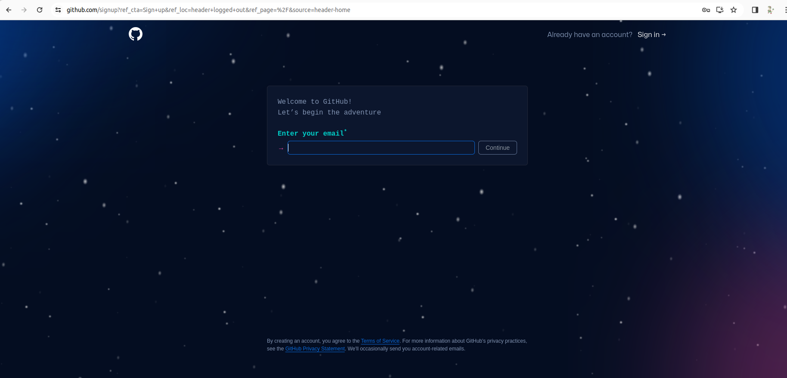
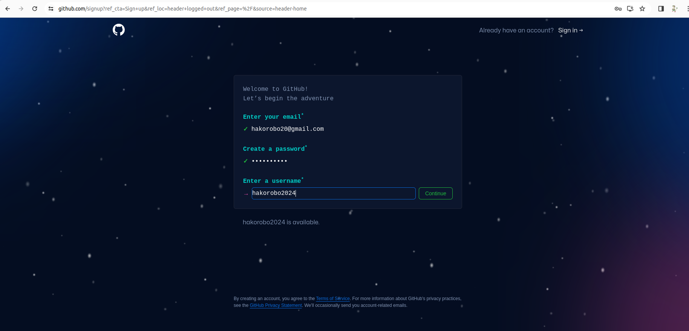

# Githubのアカウントをつくろう

## Githubサイトへ飛ぶ
[**ここ**](https://github.co.jp/)のリンクにアクセスして以下のページに飛んでください。そして、右上の**Sign up**ボタンからGithubアカウントを作成しましょう。

## Emailなどを入力
以下のページがでたらお好きな自分のメールアドレス（高専のものでも良いですがGmailで作ることをオススメします）

パスワードなども好きに設定してください。

最後のチェックマークはつけなくても大丈夫です。