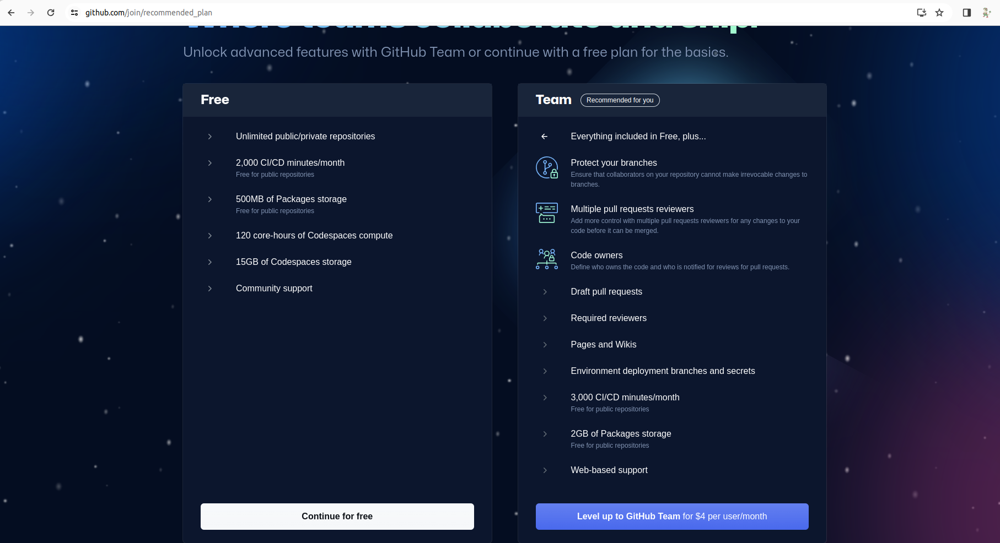
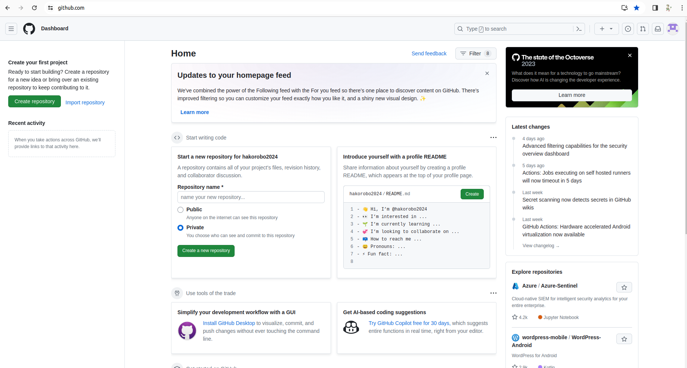

# Githubのアカウントをつくろう

## Githubサイトへ飛ぶ
[**ここ**](https://github.co.jp/)のリンクにアクセスして以下のページに飛んでください。そして、右上の**Sign up**ボタンからGithubアカウントを作成しましょう。

## Emailなどを入力
以下のページがでたらお好きな自分のメールアドレス（高専のものでも良いですがGmailで作ることをオススメします）

パスワードなども好きに設定してください。

最後のチェックマークはつけなくても大丈夫です。
AIじゃないことを証明したら設定したメールアドレスに番８桁の番号がとどくのでそれを入力してください。

## なんかよくわからない設定

するとなんかよくわからないことを聞かれると思うのでガン無視でいきましょう。

## 無料版
最後にFor freeを押したらアカウント作成完了

## 完成

次はリポジトリを作ってみましょう

[リポジトリをつくろう](./create_repo.md)