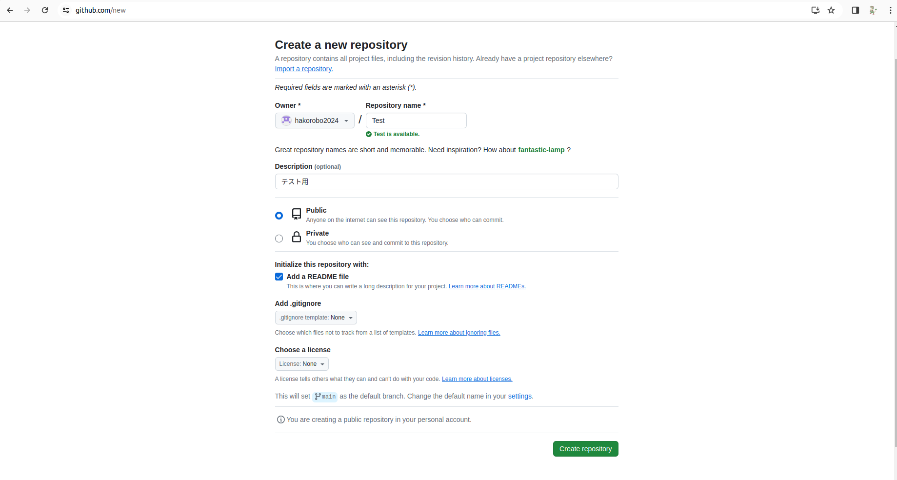

# リポジトリをつくろう
アカウントを作れたら以下のような画面になっているはずなので左上らへんにある緑色の「**Create repository**」ボタンを押してリポジトリを作成しましょう。

# リポジトリの設定
リポジトリとはGithubにおけるプログラムパッケージの最小単位でリポジトリの名前がそのままパッケージ名であることが多いです。

上から以下のような感じです。
**owner**：リポジトリの所有者を決めます。特にいじる必要はありません。

**ripository name**：リポジトリの名前です。

**Description**：リポジトリの概要です。かかなくてもよいです。

**Public or Private**：リポジトリが他の人に見られてもよいかを決めます。Publicだと世界中の人に見られるし、Privateだと許可を与えた人にのみ見えるようになります。基本的にはPublicにしましょう。

**Add a README file**：READMEファイルを追加するか否かを決定します。READMEファイルとは「Read me file」、つまり「まず読んでほしいファイル
」みたいなものですね。パッケージの内容や使い方が記述されるケースが多いです。

まだ２つほど設定がありますがしなくても良い場所なので今回はスルーします。

# リポジトリ完成
最後に下にあった緑色の「Create Repository」を押せばリポジトリの作成は完了です。

次はリポジトリにフォルダなどを追加してみましょう。

[ファイルをアップロードしよう](./add_file.md)