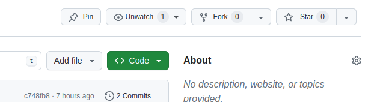
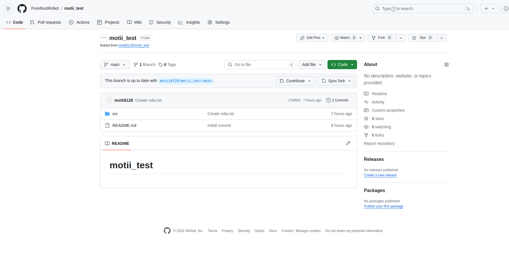
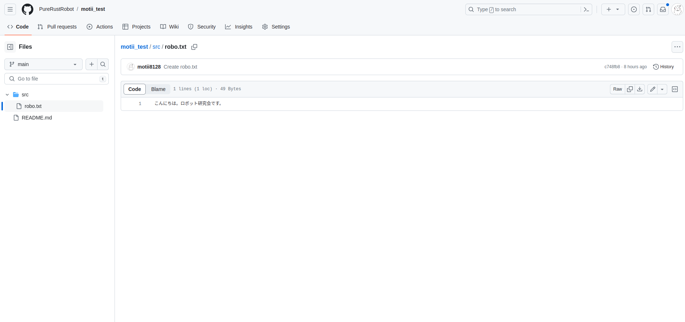
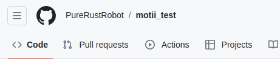
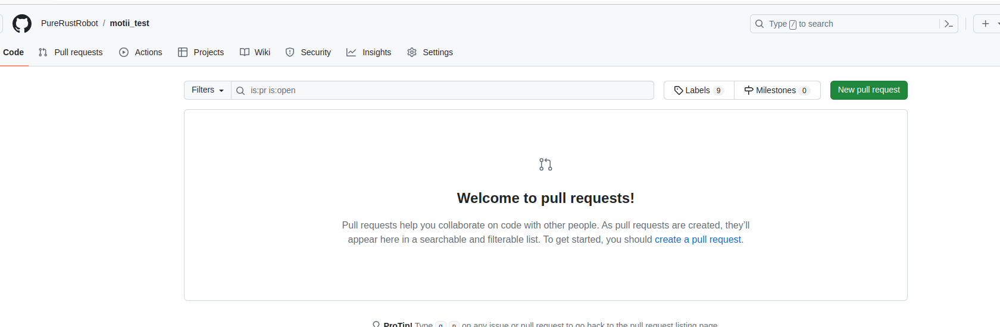
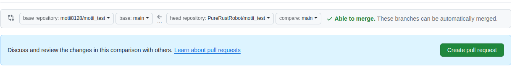
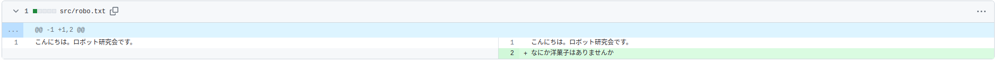
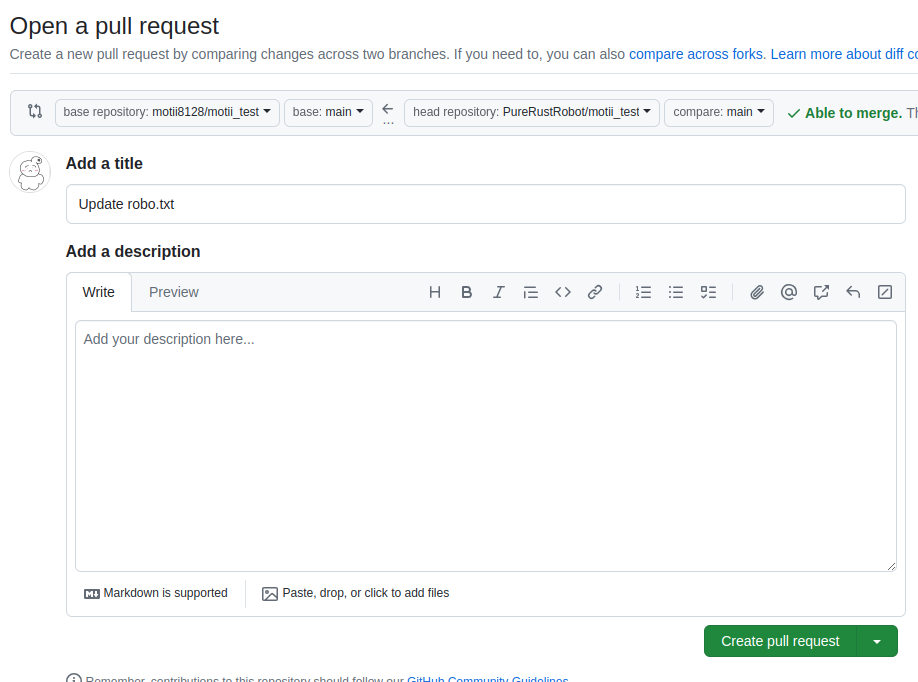

#　フォークしてプルリクエストを出す

## はじめに
今までの内容は正直Githubじゃなくても良さげでしたが今回の機能はGithubを使うにあたって一番慣れてほしいところかもしれません。
複数人開発で必要なことについてです。

## リポジトリをフォークする
他人のリポジトリを勝手に変更できないというのはご存知だと思います。それでも「この人のこのコードにこういう変更を加えて残したい！」という時とかがあるのでそのような時にフォークを使います。
フォークという言葉の本当の意味については私もよくわかりませんが、他人のリポジトリのコピーを自分のリポジトリの一つに作るというものです。操作は特に難しくないのでぱぱっとやってみましょう。

今回は前回にも登場していた私[motii](https://github.com/motii8128)のリポジトリである**motii_test**をフォークしてもらいます。[こちら](https://github.com/motii8128/motii_test)のリンクに飛んだあと下の写真のような「**Fork**」と書いてあるボタンが右上のほうにあるはずなのでクリックしてください。

そして特に変更をしないで右下の緑色のボタンをクリックすると以下のようにコピーを作成することができます。左上が「**PureRustRobot/motii_test**」となっていますがPureRustRobotの部分はあなたのユーザー名になっているはず。

ここでsrc/robo.txtの中身を書き換えてみましょう。フォークしたこのリポジトリの所有権はそのユーザーになるので変更が可能です。またここでの変更はフォークされた元には適用されません。今でいうとPureRustRobot/motii_testの内容が変わってもmotii8128/motii_testの内容は変更されないということです。

先程の画面でsrcをクリックしてさらにその後、robo.txtをクリックしてください。そして以下のような画面の右側にある鉛筆のマークを押して編集を開始しましょう。

そして今までのようにコミット（編集を完了）してください。

## プルリクエストを作成する
みんながよく「プルリク」と呼ぶものです。これはフォークした先での変更を本家に適用したいという願いを届ける仕組みです。プルリクエストを送る際にはそのリポジトリのホームにいったのちメニューバーの**Pull requests**をクリックします。

すると以下のような画面で緑色のボタンからプルリクエストを作成することができます。

プルリク作成画面については以下の２つだけ説明を加えると

### プルリクの出す先の設定

この写真に関してはどのリポジトリからどのリポジトリへの変更なのかを選ぶところです。基本勝手にフォーク先の変更をフォーク元に適用するようにしてくれます。

### どんな変更があるのかの確認

この写真に関してはどんなファイルにどんな変更があるのかを見せてくれます。

確認したら、また右のほうにある緑色の「Create pull request」というボタンをクリックしてください。

そして以下のような画面で自分のリポジトリにコミットしたときと同じようにどのような要件なのかそして詳しい説明を加えることができます。こ適宜変更をくわえたらまた緑色の「Create pull request」というボタンをクリックしてください。

これでプルリクエストの作成は完了です。あとは本家のユーザーが了承してくれればこの変更が適用されます。