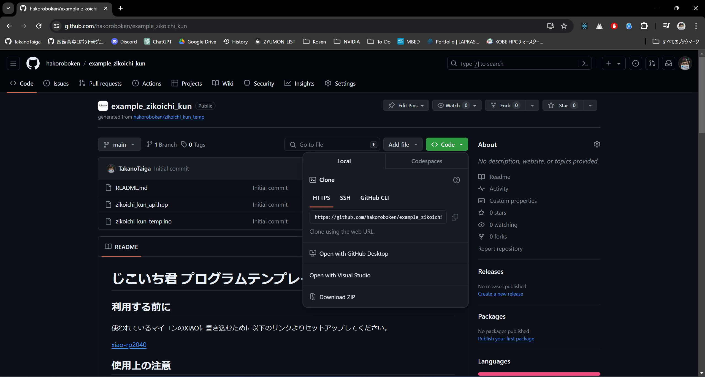

# 自己位置くんで遊ぼう

## 環境構築
[こちらのリンク](https://hakoroboken.github.io/hakorobowiki/software/setup_env/arduino_for_esp/)にある手順でArduino IDEをセットアップしてください。

## コーディングを始める

### プロジェクトをダウンロードする

[こちらのリンク](https://github.com/hakoroboken/example_zikoichi_kun)にアクセスします。アクセスして緑色の`<> Code`ボタンをクリックして表示される`Download ZIP`をクリックしてダウンロードします。ダウンロードしたら解凍して適当な場所に配置します。この時フォルダー名が`example_zikoichi_kun-main`のようになっているので`example_zikoichi_kun`に変更します。



### コーディングを開始する

`example_zikoichi_kun`フォルダ内にある`example_zikoichi_kun.ino`ファイルをダブルクリックすると`Arduino IDE`が起動します。

`.ino`ファイルには以下が記述されています。

```C++
#include "zikoichi_kun_api.hpp"

void setup() {
  zk_api::setup();
}

void loop() {
  zk_api::xyz_control(1.0, 0.0, 0.0, 50);
}
```

それでは一行ずつ解説していきます。


**まず初めはインクルードファイル**
この自己位置くんを動かすために作られたライブラリを展開します。コンパイル時の挙動はこのヘッダーファイルに記述されている内容が`#include "zikoichi_kun_api.hpp"`にコピーされます。(ここにCSVファイルを指定してデータを読み込むという裏技的な使い方もある)

```C++
#include "zikoichi_kun_api.hpp"
```

**初期化関数**
マイコンに電源が投入されてプログラムが実行される最初の一回だけ実行される関数です。この`{}`の中に最初の一回だけ実行したい処理を記述します。この例では`zikoichi_kun_api`の初期化処理が走っています。
```C++
void setup() {
  zk_api::setup();
}
```

**ループ関数**
このループはマイコンが実行されている限り無限に繰り返されます。この例だと下記と等価と考えることができます。

```C++
void loop() {
  zk_api::xyz_control(1.0, 0.0, 0.0, 50);
}

int main(void){
  while(true){
    loop();
  }
}
```

## Zikoichi Kun API

### xyz_control

`xyz_control`関数はロボットに対してXYの単位ベクトルとz軸の単位ベクトルを与え強さを与えると、ベクトル通りにロボットが移動する関数です。

```C++
zk_api::xyz_control(1.0, 0.0, 0.0, 50);
```

| 変数名 | 型 | 想定される範囲 |
|:-----------|------------:|:------------:|
| x       | float        | -1.0 ~ 1.0         |
| y       | float        | -1.0 ~ 1.0         |
| z       | float        | -1.0 ~ 1.0         |
| power   | float        | -255.0 ~ 255.0     |

入力を下記の式に基づき各モータの出力に合うようにベクトルを分解します。
$$
\begin{align}
    P_{FR} &= P_{motor} \cdot \left( + \sin(45) \cdot x - \cos(45) \cdot y + 0.5 \cdot z \right) \\
    P_{FL} &= P_{motor} \cdot \left( - \cos(45) \cdot x - \sin(45) \cdot y + 0.5 \cdot z \right) \\
    P_{RL} &= P_{motor} \cdot \left( - \sin(45) \cdot x + \cos(45) \cdot y + 0.5 \cdot z \right) \\
    P_{RR} &= P_{motor} \cdot \left( + \cos(45) \cdot x + \sin(45) \cdot y + 0.5 \cdot z \right)
\end{align}
$$

行列で書くと下記のようになります。

$$
\begin{bmatrix}
    P_{FR} \\
    P_{FL} \\
    P_{RL} \\
    P_{RR}
\end{bmatrix}
= 
\begin{bmatrix}
    0 &&  -1 && 0.5 \\
    -1 &&  0 && 0.5 \\
    1 &&  0 && 0.5 \\
    0 &&  1 && 0.5 
\end{bmatrix}
\begin{bmatrix}
    \cos(45) &&  \sin(45) && 0 \\
    -\sin(45) &&  \cos(45) && 0 \\
    0 && 0 && 1
\end{bmatrix}
\begin{bmatrix}
    x \\
    y \\
    z
\end{bmatrix}
$$

### control

特定のモータの回転速度を決める

```C++
zk_api::control_front_right(128)
```
```C++
zk_api::control_front_left(-128)
```
```C++
zk_api::control_rear_left(128)
```
```C++
zk_api::control_rear_right(-128)
```

| 変数名 | 型 | 想定される範囲 |
|:-----------|------------:|:------------:|
| power   | int        | -255 ~ 255    |