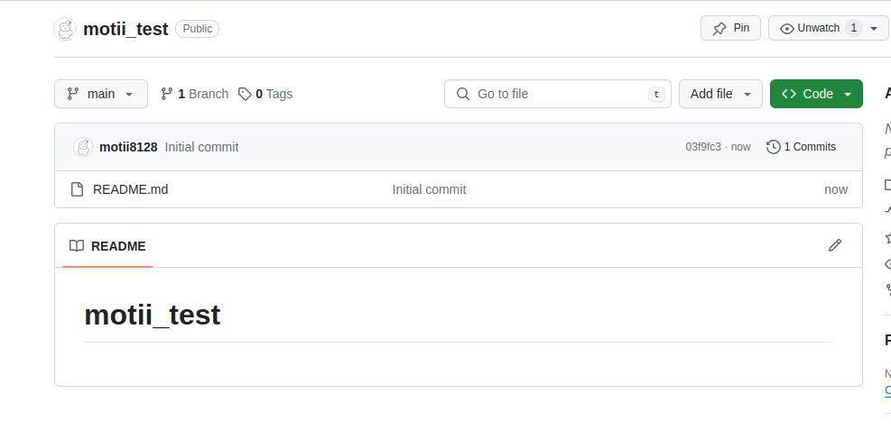
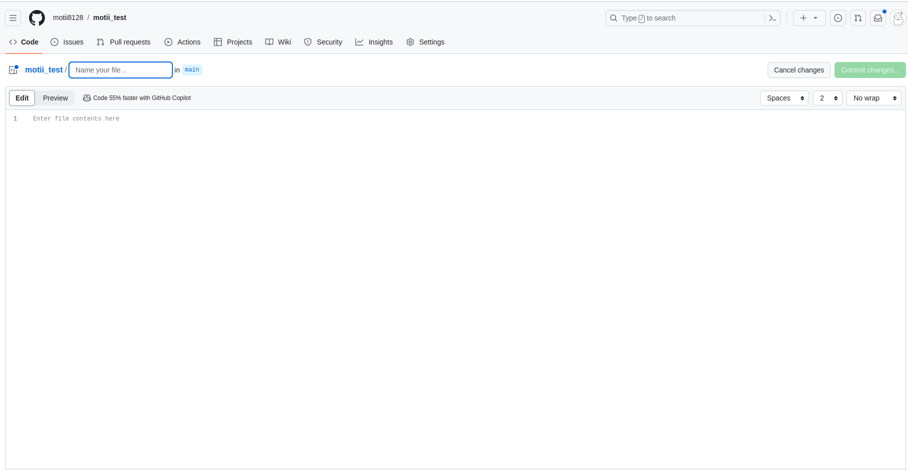
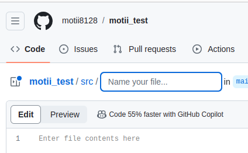
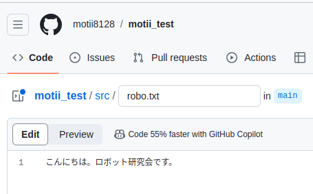
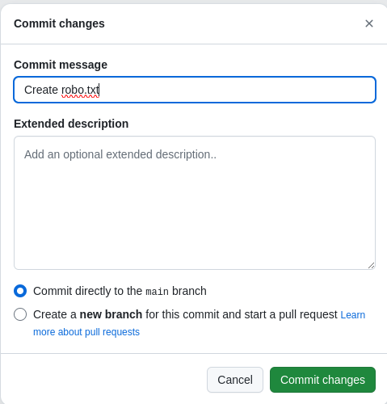
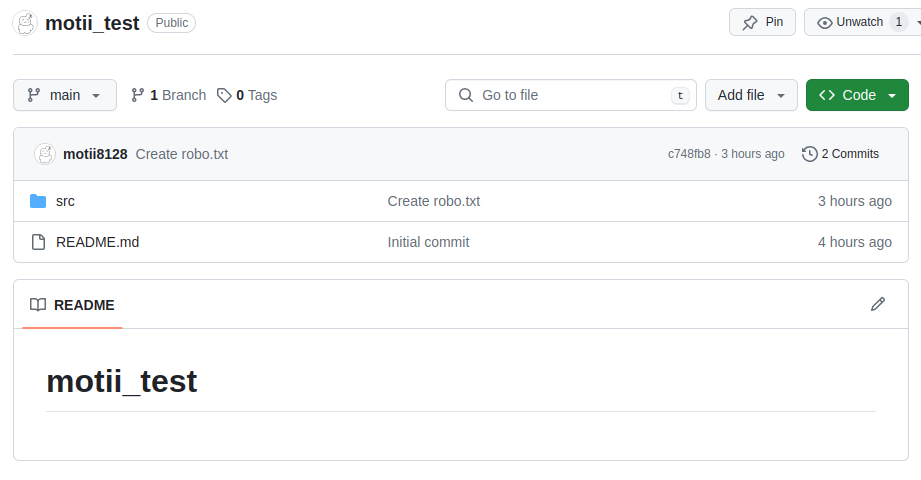

# リポジトリを編集しよう
以下のようなリポジトリを作成しました。

すると**Add file**というボタンがあるので押すと選択肢が出ると思います。ここでは「Create new file」を選択してください。ちなみに「Upload files」を押すと自分のPC内にあるファイル、フォルダをアップロードできます。

## フォルダとファイルを作る
先程示したような画面が出たら「Name your file..」みたいなところにファイル名を記述することができます。しかし今回はフォルダを作るのでこの欄に「src/」と入力してください。
すると以下のようにまた新たに「Name your file..」と出ているはず

なのでファイル名を「robo.txt」として、以下のような適当な文章を入れて右の方にある「commit changes...」をクリックしましょう。

上の画面に関して
**Commit message**：どのような要件なのかを書く。今回だとrobo.txtを作成するという変更なので自動で「Create robo.txt」というのが入力されている。

**Extended description**：追加で詳しい説明があったら入れる。（わいは使ったことがない）

そして下の選択肢についての説明には**ブランチ**について知る必要があるのでここではスキップさせていただきます。

## 完了
できていたら以下のような感じ

[**フォークしてプルリクエストをだす**](./fork_and_pullreq.md)
