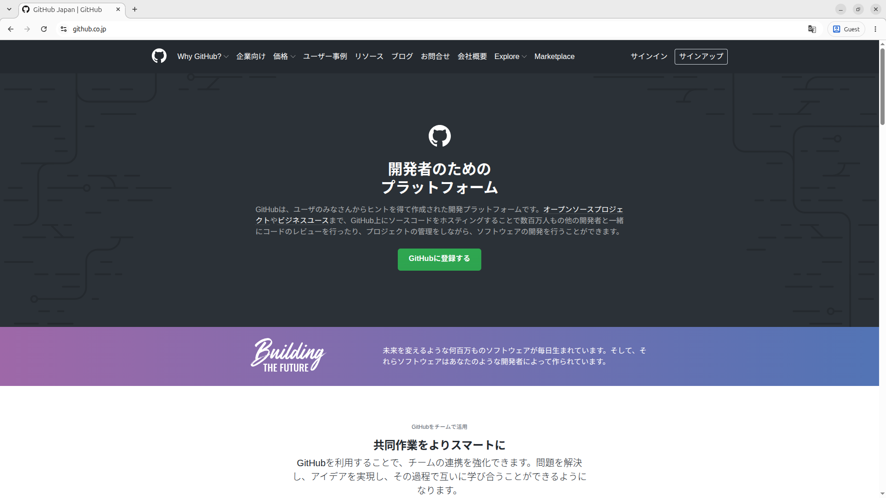
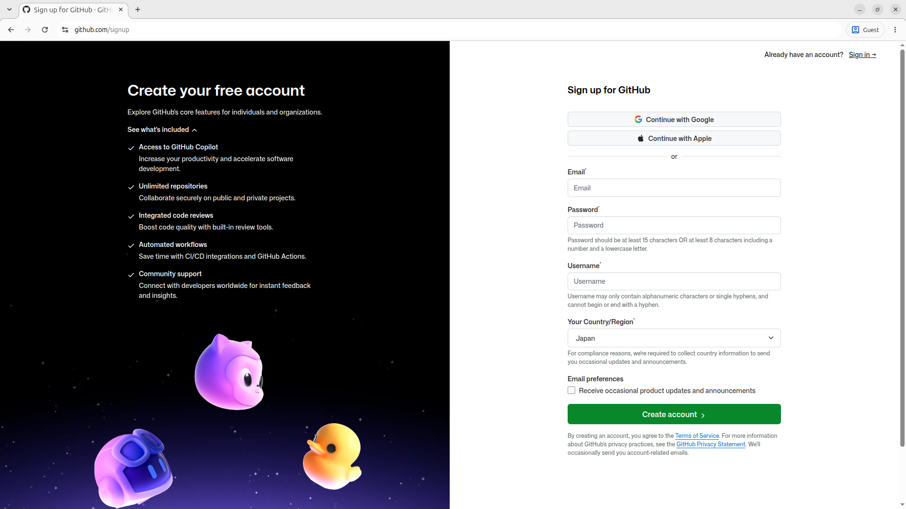

# GitHubのアカウントをつくろう

## GitHubサイトへ飛ぶ
[**ここ**](https://github.co.jp/)のリンクにアクセスして以下のページに飛んでください。そして、右上の**サインアップ**ボタンからGitHubアカウントを作成しましょう。

!!! 日本語について
    ここで悲しいお話です  
    GitHubが日本語対応しているページはここだけです...  
    これ以降のページはすべて英語になっており、言語設定はありません:sob:   
    最初はブラウザの翻訳機能を使いながらでもいいので、頑張りましょう！

## Emailなどを入力
以下のページがでたらお好きな自分のメールアドレス、パスワードなどを入力してください。  
写真の後に詳しく説明を書いておきます。

| 項目 | 説明 |
|:----|:----|
| Email | お好きな自分のメールアドレスを入力してください。 |
| Password | 15文字以上か、8文字以上で数字と小文字を両方含んでいるものを入力してください。 |

!!! メールアドレスについて
    高専のものでも良いですが、Gmailなど個人のもので作ることをオススメします  
    高専のメールアドレスは卒業のタイミングで使えなくなるので、卒業後はログインできなくなってしまいます

最後のチェックマークはつけなくても大丈夫です。
AIじゃないことを証明したら設定したメールアドレスに番８桁の番号がとどくのでそれを入力してください。

## なんかよくわからない設定

するとなんかよくわからないことを聞かれると思うのでガン無視でいきましょう。

## 無料版
最後にFor freeを押したらアカウント作成完了

## 完成

<!-- こいつは使いまわしらしい -->

次はリポジトリを作ってみましょう

[2.リポジトリをつくろう](./02.create_repo.md)